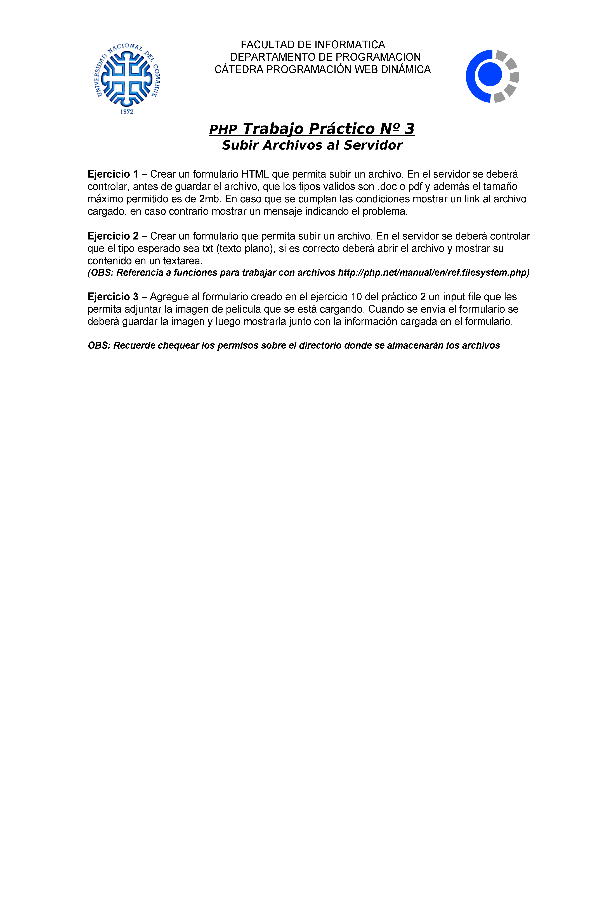

# Trabajos Practicos - Programacion Web Dinamica
## Datos del Proyecto
- **DESCRIPCION:** Trabajos practicos de la materia "Programacion WEB Dinámica"
- **PROFESORES:** Sanchez Viviana, Pino Maria Laura, Carrasco Claudia
## Datos Institucionales
- **NOMBRE Y APELLIDO:** Omar Lestrade
- **LEGAJO:** FAEA-775
- **AÑO:** 2º
- **CUATRIMESTRE:** 1º
- **CARRERA:** Tecnicatura Universitaria en Desarrollo Web
- **MATERIA:** Programacion WEB Dinámica
## Datos del grupo
- **NOMBRE DEL GRUPO:** 9
- **INTEGRANTES:** 
  - Almirón Abigail Juliana -FAI- - @est.fi.uncoma.edu.ar - [GitHub](https://github.com/abialmiron/)
  - Flores Agustina -FAI-3547 - ailen.flores@est.fi.uncoma.edu.ar - [GitHub](https://github.com/agusflores1/)
  - Gaspart Sabrina - FAI-112 - grethel.gaspart@est.fi.uncoma.edu.ar - [GitHub](https://github.com/sabrinagaspart)
  - Lestrade Zapata Omar - FAEA-775 - omar.lestrade@est.fi.uncoma.edu.ar - [GitHub](https://github.com/Lestradez)
  - Salto Tomas - FAI-3635 - tomas.salto@est.fi.uncoma.edu.ar - [GitHub](https://github.com/tomassalto)

## Tabla de Contenidos
### Trabajo Practico 1

- [MENÚ](./TP1/Vista/MENU.html)
- [Ejercicio 1](./TP1/Vista/vistaej1.html)
- [Ejercicio 2](./TP1/Vista/vistaej2.html)
- [Ejercicio 3](./TP1/Vista/vistaej3.html)
- [Ejercicio 4](./TP1/Vista/vistaej4.html)
- [Ejercicio 5](./TP1/Vista/vistaej5.html)
- [Ejercicio 6](./TP1/Vista/vistaej6.html)
- [Ejercicio 7](./TP1/Vista/vistaej7.html)
- [Ejercicio 8](./TP1/Vista/vistaej8.html)
### Trabajo Practico 2

- [PORTADA](./TP2/ej1.html)

### Trabajo Practico 3

- [Ejercicio 1](./TP3/Ej1)
- [Ejercicio 2](./TP3/Ej2)
- [Ejercicio 3](./TP3/Ej3)